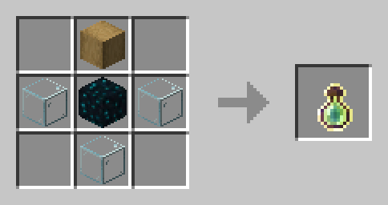

# 🧾 Кастомные крафты

> **Лодки**
>
> P.S. Дубовые доски используются как образец ингредиента для крафта, что бы скрафтить Мангровую или другую разновидность лодки нужно лишь заменить дубовые доски на соответствующий вид досок.\
>  (1) (1).png>)

> **Древесный уголь** \
> в **Коптильне**
>
> P.S. Это дополнительный крафт Древесного угля P.S.S. Дубовое бревно используется как образец ингредиента для крафта, древесный уголь крафтиться из любого вида бревен/\
>  (1).png>)

> **Сундук**
>
> P.S. Это дополнительный крафт Сундука P.S.S. Дубовое бревно используется как образец ингредиента для крафта, сундук крафтиться из любого вида бревен.\
> .png>)

> **Глина**\
>  (1).png>)

> **Блоки из слитков** \
> в Печке и Плавильне
>
> P.S. Это дополнительный крафт Блоков из слитков P.S.S. Блок рудной меди используются как образец ингредиента для крафта, что бы скрафтить Железный или другой блок слитков нужно лишь заменить блок рудной меди на соответствующий вид рудного блока.\
> .png>)

> **Кусочки железа** \
> в Камнерезе
>
> P.S. Это дополнительный крафт Кусочков железа\
> .png>)

> **Кожи** \
> в Коптильне &#x20;
>
> P.S. Это дополнительный крафт Кожи\
> .png>)

> **Блок света**\
> .png>)

> **Бирка**\
>  (1).png>)

> **Незерский росток**\
> .png>)

> **Яблоко Нотча**\
> .png>)

> **Плачущий обсидиан**\
> .png>)

> **Пиво?** **Нет, Седло**\
> .png>)

> **Кремень**\
> .png>)

> **Слизь** \
> в Плавильне\
> .png>)

> **Паутина**\
> .png>)

> **Нить**
>
> 2 - P.S.S. Белая шерсть используется как образец ингредиента для крафта, нитки крафтяться из любого вида шерсти.\
> .png>).png>)

> **Трезубец**\
> .png>)

> **Конская броня**
>
> P.S. Железный слиток используются как образец ингредиента для крафта, что бы скрафтить Железную или другую конскую броню нужно лишь заменить блок железный слиток на соответствующий предмет.\
> .png>)

> **Бутылек опыта**
>
> P.S. Обтёсанная дубовое бревно используется как образец ингредиента для крафта, бутылек опыта крафтиться из любого вида обтёсанных бревен.
>
> 

> **Палка отладки**
>
> .png>)
